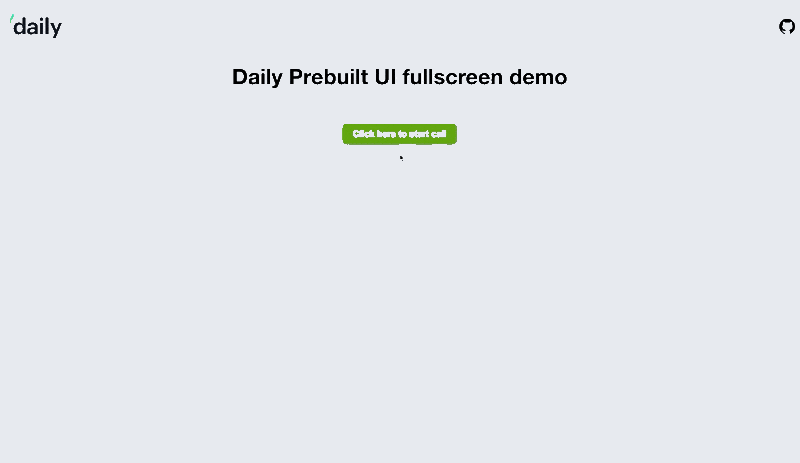

# Daily fullscreen prebuilt UI demo

This demo highlights [Daily's prebuilt UI](https://www.daily.co/blog/prebuilt-ui/), and how it can be expanded fullscreen in a website or app.

## Prerequisites

- [Sign up for a Daily account](https://dashboard.daily.co/signup) to add your own room URL to the demo, instead of using our demo room generator helper function.

## How the demo works

A participant clicks a "Click here to start a call" button, triggering a function that generates a temporary demo room URL and creates a DailyIframe. The [`iframeStyle` properties](https://docs.daily.co/reference#properties) passed when the DailyIframe is created set the prebuilt UI to fullscreen.

## Running locally

1. `cd daily-demos`
2. `cd static-demos`
3. `npm run start` or `npm run dev`
4. Then open your browser and go to `localhost:<port>/static-demos/fullscreen-prebuilt-ui/index.html`

## Contributing and feedback

Let us know how experimenting with this demo goes! Feel free to reach out to us any time at `help@daily.co`.

## What's next

To learn how to build a call interface around the callframe using daily-js methods and events, have a look at our prebuilt UI demo.
